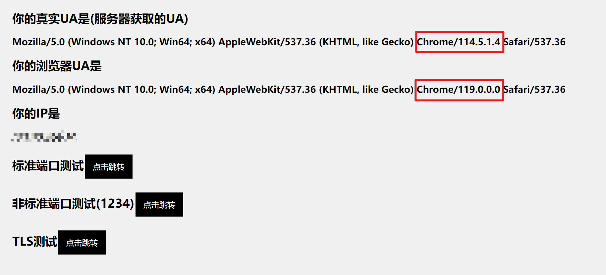

# Openwrt With Ua2f

## 更新记录:
- 2024.03.20
    1. [GiwifiScript](https://github.com/GiraffeLe/GiwifiScript),用shell写的登录脚本,适合安装在路由器上面.原作者:[TwiceTry](https://github.com/TwiceTry)
    2. [Giwifi-python](https://github.com/mcitem/auth-giwifi-python),用python写的登录脚本,作者:[mcitem](https://github.com/mcitem)
- 2024.03.04 
    1.  添加了华三NX30Pro的固件,使用openwrt源码23.05分支构建,已添加ua2f,**请谨慎使用**,详情见release里NX30Pro固件的说明.
    最下方有一些个人在刷openwrt时遇到的问题及解决方案的链接.
    2. HPU的同学可以看一下[这里(Auto-Giwifi)](https://github.com/GiraffeLe/Auto-Giwifi),自己用node写的自动登录的js脚本,不过不太适用于在路由器上
    ~~(希望有好心人写一个py版本的.有的话可以联系我(~~

- 2023.12.03 重写Readme,旧的文件已移动到别的位置.
    在这里:[旧Readme](./file/README(old).md)

## 提示:
**重要:**

路由器性能比较好的朋友不妨看一下[ua3f](https://github.com/SunBK201/UA3F),实现比较简单,不需要自己编译固件了,并且可以与代理工具共存.只用给路由器刷上openwrt即可.

## 快捷导航

[更新记录](#更新记录)

[介绍](#介绍)

[适用人群](#适用人群)

[参考文章](#参考文章)

## 用处:

- √ 摆脱设备限制 => 可以与室友共用来平摊上网费用
- √ 提高网络稳定性(至少在我们宿舍是这样)
- × 并不能破解校园网.
- 其他功能可在编译固件时根据个人需求添加.

## 介绍:

本项目是通过给路由器刷openwrt并安装ua2f插件来达到躲避校园网检测.

可用于 河南理工大学HPU的GiWiFi

**缺点**:

ua2f会和路由器上的clash等代理工具起冲突,所以如果需要科学上网的话还是只在自己的终端设备(手机,电脑)上打开吧.

### 适用人群:

本项目适合:

- **计算机相关知识**
- **一定的动手能力**

不建议无计算机知识的朋友尝试此项目.

### 原理:

利用ua2f插件修改设备发出的用户标识,让校园网的检测设备以为这些请求都是来自同一设备.

### Openwrt介绍:

>OpenWrt 是一个用于嵌入式设备的自由开源的 Linux 操作系统。它专门设计用于路由器、无线接入点、嵌入式系统等网络设备。OpenWrt 允许用户利用这些设备的硬件性能和功能，通过安装软件包和自定义设置，来构建自己所需的定制化网络环境。(ChatGPT)

Openwrt官网: [链接](https://openwrt.org/)

Github: [链接](https://github.com/openwrt/openwrt)

### UA2F介绍:

详情见作者博客:

[UA2F](https://learningman.top/archives/304)

### 效果演示:

[UA检测](http://ua.233996.xyz/)

如果配置好之后网站中显示的两个UA还是相同,不一定是没有配置成功,可能是浏览器的问题,可以换别的浏览器(firefox,chrome,edge)进行尝试.

## 参考文章:

[**Openwrt编译与防检测部署-Sunbk201**](https://sunbk201public.notion.site/sunbk201public/OpenWrt-f59ae1a76741486092c27bc24dbadc59)

[小米/红米AC2100刷Breed-恩山论坛](https://www.right.com.cn/forum/forum.php?mod=viewthread&tid=4066963&highlight=%CB%A2breed)

[校园网路由器多设备伪装指北](https://learningman.top/archives/304) 

[UA2F-Github项目](https://github.com/Zxilly/UA2F)

---
**H3C NX30Pro** 看这里

我在这里列出了一些链接,方便各位更好的给NX30pro刷机.

[原厂刷Lede/ImmortalWrt和刷回官方](https://www.right.com.cn/forum/thread-8291820-1-1.html)

[Page not found 问题(个人建议开无痕模式进入后台)](https://www.right.com.cn/forum/thread-8294395-1-1.html)

[openwrt官方固件自定义防火墙规则(针对firewall4)](https://www.right.com.cn/forum/thread-8305441-1-1.html)

[H3C刷Openwrt官方版教程](https://github.com/openwrt/openwrt/pull/12820)

["Can't open device for writing" 问题](https://www.right.com.cn/forum/thread-8316238-1-1.html)

