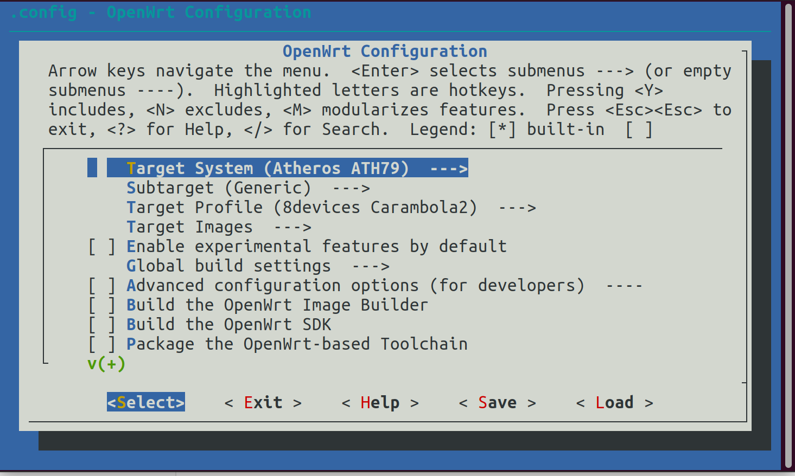
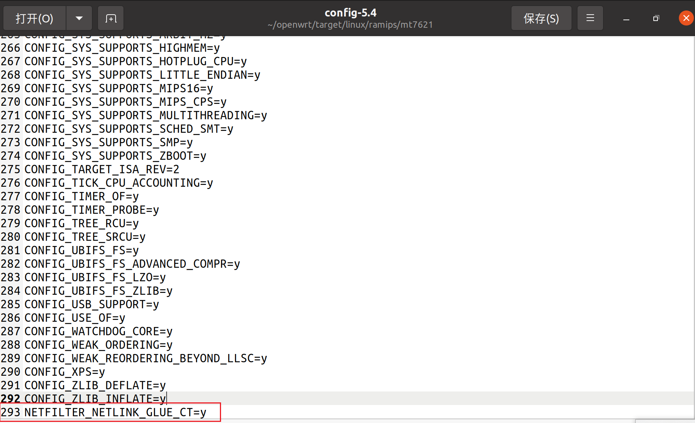

# openwrt固件编译：

## 正文：

```
！！！请保证全局魔法环境，编译失败的大多数原因是网络问题。！！！
！！！请保证全局魔法环境，编译失败的大多数原因是网络问题。！！！
！！！请保证全局魔法环境，编译失败的大多数原因是网络问题。！！！
```

[^]: 如果物理机上的clash没法开启tun mode，可以尝试在虚拟机内安装。

### 本地编译：

Ubuntu：[链接](https://cn.ubuntu.com/download/desktop)

VMare 虚拟机：[链接](https://customerconnect.vmware.com/cn/downloads/details?downloadGroup=WKST-PLAYER-1701&productId=1377&rPId=100678)

tip:不建议用微软自带的hyper-v,因为折腾起来非常麻烦。


### 配置编译环境：

更新软件包

```
sudo apt-get update -y
sudo apt-get upgrade -y
```

安装编译依赖

```
sudo apt install -y ack antlr3 aria2 asciidoc autoconf automake autopoint binutils bison build-essential \
bzip2 ccache cmake cpio curl device-tree-compiler fastjar flex gawk gettext gcc-multilib g++-multilib \
git gperf haveged help2man intltool libc6-dev-i386 libelf-dev libglib2.0-dev libgmp3-dev libltdl-dev \
libmpc-dev libmpfr-dev libncurses5-dev libncursesw5-dev libreadline-dev libssl-dev libtool lrzsz \
mkisofs msmtp nano ninja-build p7zip p7zip-full patch pkgconf python2.7 python3 python3-pip libpython3-dev qemu-utils \
rsync scons squashfs-tools subversion swig texinfo uglifyjs upx-ucl unzip vim wget xmlto xxd zlib1g-dev
```

下载源码：

```
git clone https://github.com/openwrt/openwrt.git && cd openwrt
```

因为openwrt-22.03及以后的版本用的nftables,为避免兼容性问题和本人能力目前有限，还不会解决nftables，故这里继续用 openwrt-21.02

原文章这里用的是23版，不过可能是是我没折腾明白，编出的固件没法用iptables

**2024.3.4补充**: 已经有一个不太完美的解决方案 [链接](https://www.right.com.cn/forum/thread-8305441-1-1.html)


 [SunBK201的openwrt编译与防检测部署](https://sunbk201public.notion.site/sunbk201public/OpenWrt-f59ae1a76741486092c27bc24dbadc59)

切换分支


~~~
git checkout openwrt-21.02
~~~

更新 feeds 软件源


```
./scripts/feeds update -a
```

安装 feeds 软件包

```
./scripts/feeds install -a
```

[^注]: 此处即使在魔法环境下也会下载失败，多试几次就行了

### 配置固件：

```
！！！为了防止手滑退出配置菜单，建议多多保存配置文件。以防重新从头配置。
```

### 重要说明：

~~如果你的校园网用的是**GWifi**的话，图省事的话只需修改ttl即可防检测,但是**极少数**情况下会被检测到，目前还不清楚原因。使用ua2f+ttl方案的话虽然相对麻烦但能**保证不被检测到**。~~


**加入ua2f插件（选择只修改ttl方案可跳过这一步）**

```
#我们选择ua2f+ttl伪装方案
git clone https://github.com/Zxilly/UA2F.git package/UA2F
```


**此处为可选插件（非必须）**

argon主题
原链接：[链接](https://github.com/jerrykuku/luci-theme-argon)

```
git clone https://github.com/jerrykuku/luci-theme-argon.git  package/luci-theme-argon
#在LUIC ->Theme中勾选Luci-theme-argon
```

~~本来打算再放个解锁网易云音乐的，但是个人遇到点小问题，于是把这个插件删掉了，不过用L大的源码的话没问题（L大好像内置，直接勾选就行）~~


加入好插件之后

```
make menuconfig	
```

大概这样



如果出现"Your display is too small to run Menuconfig!It must be at least 19 lines by 80 columns." 把窗口调大就行。 

**操作说明**


这里用键盘上的“← →”来控制

“↑，↓”是控制中间部分的。

“Enter”键进入子菜单

空格键 可以切换状态

*代表内置

m是只编译不加入到固件中(后期可以通过`opkg install`安装)

/键是搜索

？键是帮助

**选择自己设备（以红米AC2100为例）**

```
# Target System
	->MediaTek Ralink Mips
# Subtarget
	->MT7621 based boards
# Target Profile
	->Xiaomi Redmi Router AC2100
```

```
#选上ua2f插件（选择只修改ttl方案可跳过这一步）
#位置在：
# Network
	->Routing and Redirection
		->ua2f
			Enable custom User-Agent   
			选不选自定义ua看个人情况，
			如果改的话建议和真实ua做出差别方便区分
```

~~6.3补充：（实验性个人还没尝试）可以把ua2f模块化<M>，方便更新，内置的话需要重新编译固件~~ 后续更新从作者那里找到对应自己架构的版本下载然后安装就行

```
#加入Luci
# Luci
	1.Collections
		->luci
	2.Modules
		->Translations
			->Chinese Simplified (zh_Hans)
		->luci-compat
```

```
#加入防TTL检测依赖
#选上两个模块：iptables-mod-ipopt, kmod-ipt-ipopt，
# iptables-mod-ipopt
	Network
	->Firewall
    
# kmod-ipt-ipopt
	Kernel modules
	->Netfilter Extensions
#其他依赖
#  Network
	->ipset
#	->Firewall
		->iptables-mod-conntrack-extra	
```

~~补充：
如果采用的是只修改ttl的话，记得去
Base system
	→dnsmasq 取消勾选
如果忘了取消勾选在编译的时候会出现问题。~~


**都选好之后保存** 

接下来进入内核配置菜单（选择只修改ttl方案可省略这一步）

```
make kernel_menuconfig
```

```
#花费时间较长，请耐心等待或者挂后台去干别的事。
#成功之后会进去kernel configuration界面
	Networking support
	->Networking options
		->Network packet filtering framework (Netfilter)
			->Core Netfilter Configuration
				->Netfilter NFNETLINK interface
				->Netfilter LOG over NFNETLINK interface
				->Netfilter connection tracking support
				->Connection tracking netlink interface
				->NFQUEUE and NFLOG integration with Connection Tracking
```

这个大概得一个小时左右。

实在嫌慢的话可以在内核文件中加入`NETFILTER_NETLINK_GLUE_CT=y`

以我的设备红米ac2100为例：

```
openwrt/target/linux/ramips/mt7621中的config-5.4文件
```




### 编译：

```
# 预下载编译所需的软件包
make download -j$(nproc) V=s
```

[^]: 确保这里没有报错，报错的话多试几次。

建议在开始编译之前再检查一次设置是否保存成功

```
#编译(-j后面是线程数，第一次建议用单线程)
make V=s -j1
```

编译好的固件在 **/bin/target**里面。

找到文件导出到自己电脑内就行。

## 到此为止编译结束


