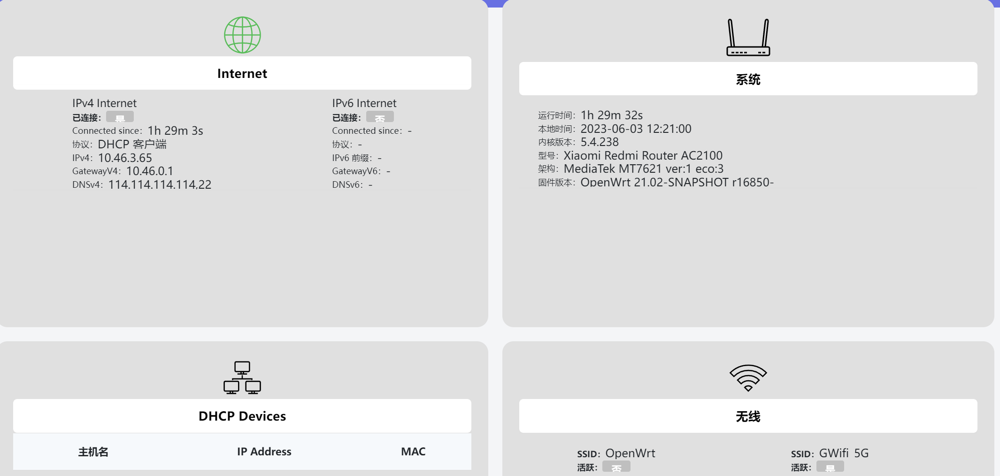
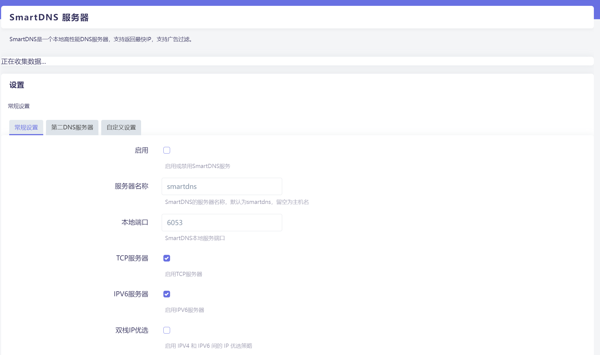
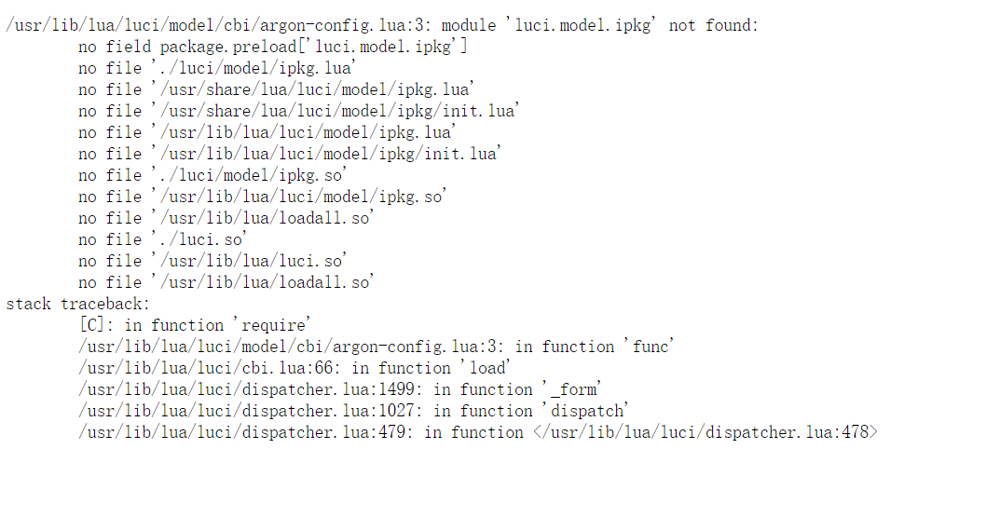

## 知识补充：

luci是一个可视化界面，只装luci不行，还得装具体应用，之前的网易云应该就是因为这个，还有frpc也是只勾选了luci-app-frpc,忘了还有个frpc

## 插件说明：

### luci-dashboard



### luci-smartdns



### luci-app-ttyd


网页输入命令行


## luci-app-argon-config



```
/usr/lib/lua/luci/model/cbi/argon-config.lua:3: module 'luci.model.ipkg' not found:
	no field package.preload['luci.model.ipkg']
	no file './luci/model/ipkg.lua'
	no file '/usr/share/lua/luci/model/ipkg.lua'
	no file '/usr/share/lua/luci/model/ipkg/init.lua'
	no file '/usr/lib/lua/luci/model/ipkg.lua'
	no file '/usr/lib/lua/luci/model/ipkg/init.lua'
	no file './luci/model/ipkg.so'
	no file '/usr/lib/lua/luci/model/ipkg.so'
	no file '/usr/lib/lua/loadall.so'
	no file './luci.so'
	no file '/usr/lib/lua/luci.so'
	no file '/usr/lib/lua/loadall.so'
stack traceback:
	[C]: in function 'require'
	/usr/lib/lua/luci/model/cbi/argon-config.lua:3: in function 'func'
	/usr/lib/lua/luci/cbi.lua:66: in function 'load'
	/usr/lib/lua/luci/dispatcher.lua:1499: in function '_form'
	/usr/lib/lua/luci/dispatcher.lua:1027: in function 'dispatch'
	/usr/lib/lua/luci/dispatcher.lua:479: in function </usr/lib/lua/luci/dispatcher.lua:478>
```

解决方案：

安装==luci-lib-ipkg==

```
opkg install luci-lib-ipkg
```

